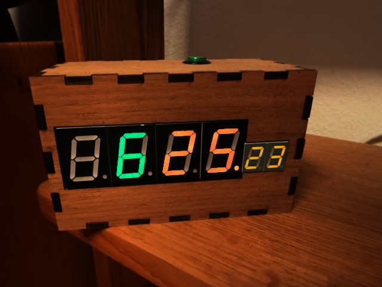

# Sevensegment-Clock

A NeoPixel seven-segment clock in a finger-jointed wooden box. It has been sitting on my
shelf telling the time since 2020, which is longer than most of my projects survive.



*Hours in green, minutes in orange, seconds ticking away on the small display at the right.*

---

## How it works

The four big digits aren't a display module — they're **32 individually addressable NeoPixels**
(`board.D10`, brightness 0.9), seven per digit plus the dots between them. Lighting up a "5"
means turning on the right six pixels and blanking the seventh, which is exactly what the
`number()` function does: take a digit, take three RGB values, set seven pixels.

Because every segment is its own LED, each digit can be any colour. Hours and minutes are
driven with separate colour variables, which is why they don't match in the photo.

The small two-digit seconds display on the right is a different animal — a conventional
seven-segment display driven through a **74HC595 shift register**, clocked out bit by bit in
`hc595_shift()` over three GPIO lines (SDI, RCLK, SRCLK).

The **dots along the bottom** are the other way of watching the seconds: one dot travels
across the display and back again, one step per second, so you can see time passing out of
the corner of your eye without reading anything.

**The button** on top (GPIO 20) picks seven new random colours every time you press it. No
menu, no configuration — press it until you like what you see.

**Keeping time.** A Pi Zero has no real-time clock, so a **cron job syncs the system time
twice a day**, once in the morning and once in the afternoon. That's enough to keep the drift
invisible without the clock needing an RTC of its own.

---

## Hardware

- Raspberry Pi Zero
- 32 NeoPixels arranged as four seven-segment digits plus dots, on GPIO 10
- 74HC595 shift register driving a two-digit seven-segment display for the seconds
- One push button on GPIO 20
- Laser-cut finger-jointed wooden case

## Dependencies

```
neopixel
adafruit-blinka
RPi.GPIO
gpiozero
```

## Running

```bash
python3 timepiv11.py
```

It reads the system clock, which the cron job keeps honest — see above.

---

*An early project of mine, and it shows in places — but it has run for years without complaint,
so I've left the code as it was written.*
